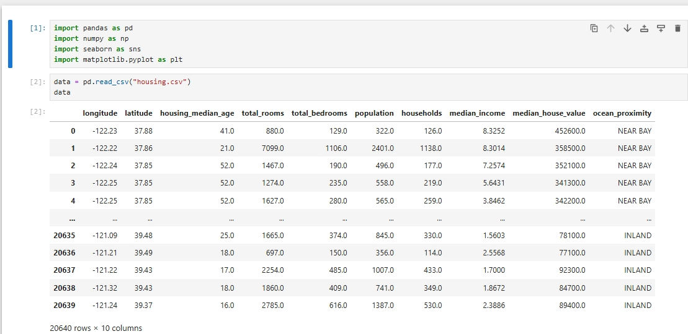
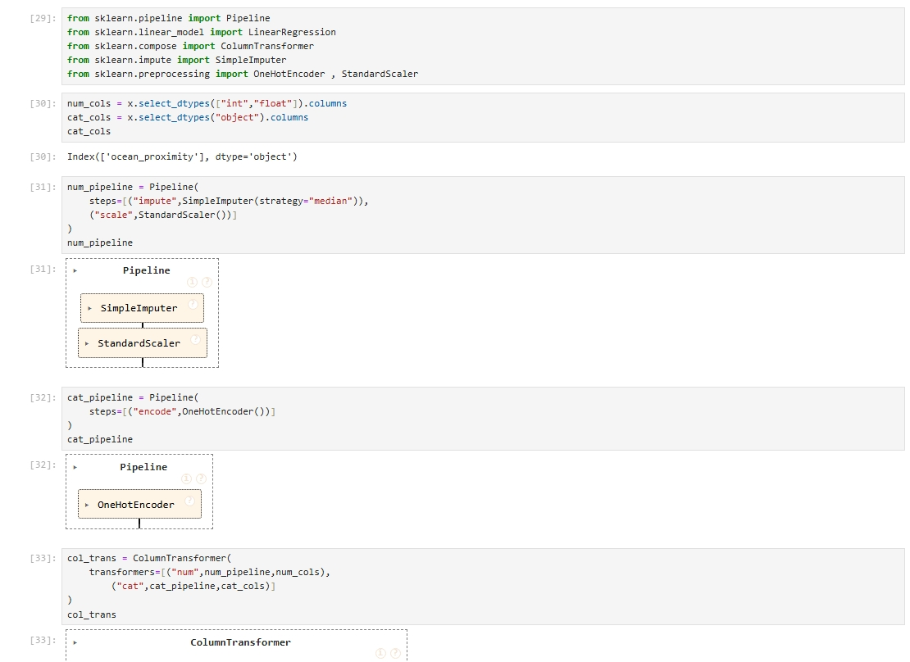
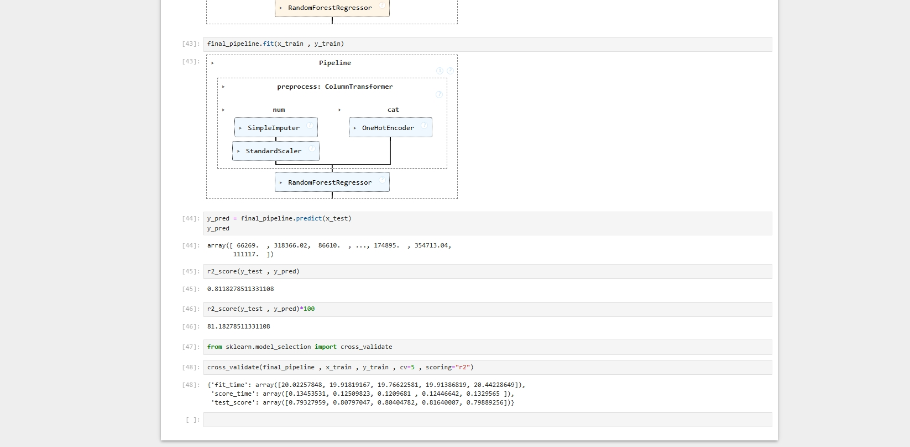

🏠 Housing Price Prediction (Machine Learning Project)

📌 Project Overview

This project focuses on predicting housing prices using Machine Learning techniques.
The dataset contains features like location, total rooms, population, and median income.

---

🚀 Features

- Data preprocessing (handling missing values)
- Data visualization using graphs
- Feature engineering
- Machine Learning model training
- Model evaluation using R² score
- Pipeline implementation using Scikit-learn

---

🛠️ Tech Stack

- Python
- Pandas
- NumPy
- Matplotlib
- Seaborn

---

📊 Dataset

- File: "housing.csv"
- Contains housing-related features for prediction

---

⚙️ Machine Learning Workflow

1. Data Loading using Pandas
2. Data Cleaning & Preprocessing
3. Visualization (scatter plots, boxplots)
4. Feature Selection
5. Pipeline Creation:
   - SimpleImputer
   - StandardScaler
   - OneHotEncoder
6. Model Used:
   - RandomForestRegressor
7. Model Evaluation:
   - R² Score ≈ 81% accuracy

---

📸 Screenshots

📊 Data Preview

⚙️ Model Pipeline

📈 Model Accuracy

---

▶️ How to Run

1. Clone the repository:
   git clone https://github.com/kirtisahu82/machine-learning-project.git

2. Open project folder

3. Install dependencies:
   pip install pandas numpy matplotlib seaborn scikit-learn

4. Run the notebook:
   machine_learning_project.ipynb

---

💡 Real World Use Case

This model helps in predicting house prices based on different features.
Useful for real estate analysis and investment decisions.

---

⚠️ Important Notes

- Make sure all libraries are installed
- Dataset file should be in the same folder
- Do not upload very large files

---

🌟 Author

Kriti Sahu
